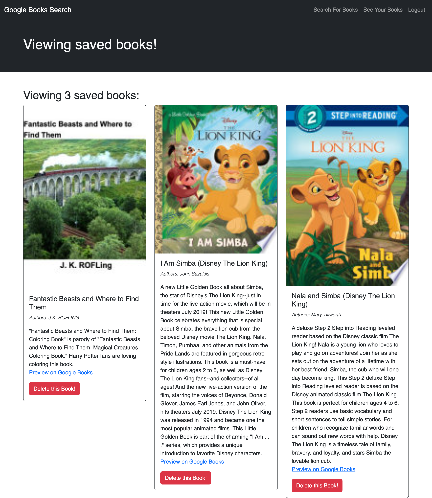
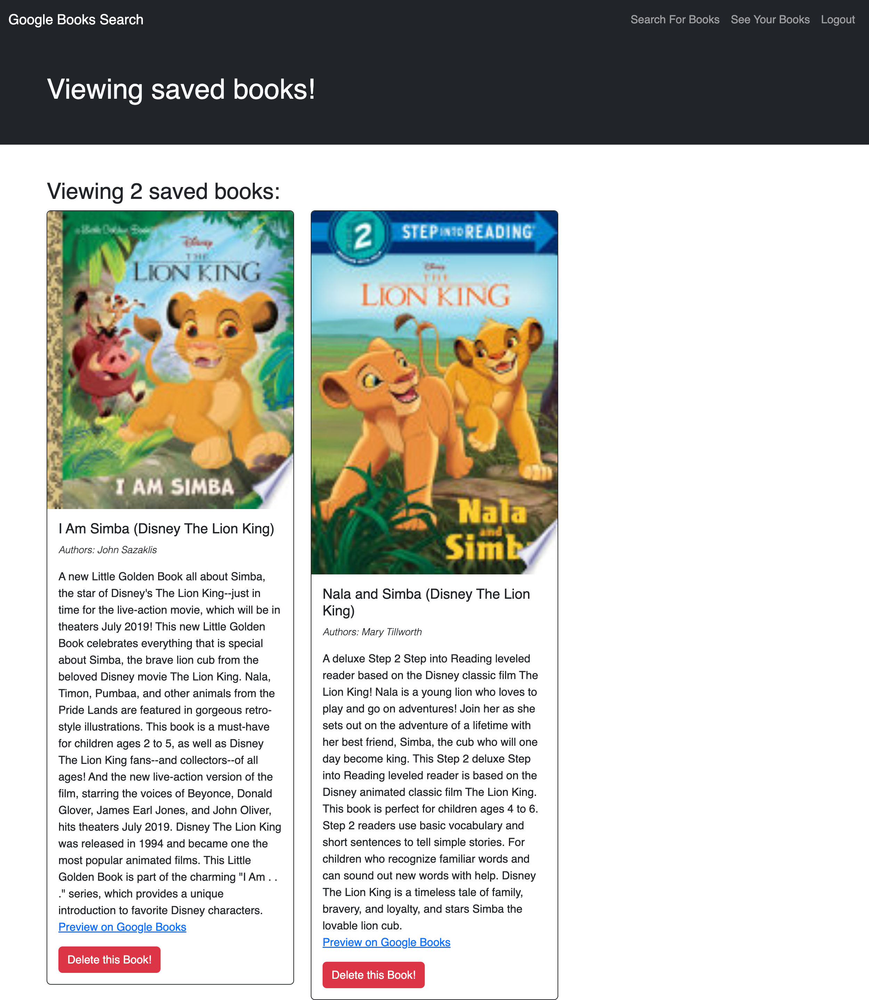

# BookSearch-MERN  

## Description
This Books API search engine is built with a RESTful API, and refactor it to be a GraphQL API built with Apollo Server. This app is built using the MERN stack with a React front end, MongoDB database, and Node.js/Express.js server and API.

## Tables of content:
  * [Installation](#installation)
  * [Usage](#usage)
  * [License](#license)
  * [Contributors](#contributors)
  * [Test](#test)
  * [Questions](#questions)

## Installation

1. Install node.js to run this application
2. Create a .gitignore file and include node_modules/ and .DS_Store/ so that your node_modules directory isn't tracked or uploaded to GitHub. Be sure to create your .gitignore file before installing any npm dependencies.
3. Make sure that your repo includes a package.json with the required dependencies. You can create one by running npm init when you first set up the project, before installing any dependencies.
4. Create the react app with aoo name client with [Create React App].[npx create-react-app <app-name>]
5. Run command npm i express to create Express.js for Routing.
6. Run command npm i mongoose to create mongoose package to connect MongoDB database.
7. Install bcrypt,jsonwebtoken,graphql,apollo-server-express and @apollo/client.
8. Set up an Apollo Server to use GraphQL queries and mutations to fetch and modify data.
9. Created an Apollo Provider so that requests can communicate with an Apollo Server.
10. Deployed application to Heroku with a MongoDB database using MongoDB Atlas.

## Usage 

1. GIVEN a book search engine.
WHEN I load the search engine,
THEN I am presented with a menu with the options Search for Books and Login/Signup and an input field to search for books and a submit button.
2. WHEN I click on the Search for Books menu option,
THEN I am presented with an input field to search for books and a submit button.
3. WHEN I am not logged in and enter a search term in the input field and click the submit button,
THEN I am presented with several search results, each featuring a book’s title, author, description, image, and a link to that book on the Google Books site.
4. WHEN I click on the Login/Signup menu option,
THEN a modal appears on the screen with a toggle between the option to log in or sign up.
5. WHEN the toggle is set to Signup,
THEN I am presented with three inputs for a username, an email address, and a password, and a signup button.
6. WHEN the toggle is set to Login,
THEN I am presented with two inputs for an email address and a password and login button.
7. WHEN I enter a valid email address and create a password and click on the signup button,
THEN my user account is created and I am logged in to the site
8. WHEN I enter my account’s email address and password and click on the login button,
THEN I the modal closes and I am logged in to the site.
9. WHEN I am logged in to the site,
THEN the menu options change to Search for Books, an option to see my saved books, and Logout.
10. WHEN I am logged in and enter a search term in the input field and click the submit button,
THEN I am presented with several search results, each featuring a book’s title, author, description, image, and a link to that book on the Google Books site and a button to save a book to my account.
11. WHEN I click on the Save button on a book,
THEN that book’s information is saved to my account.
12. WHEN I click on the option to see my saved books,
THEN I am presented with all of the books I have saved to my account, each featuring the book’s title, author, description, image, and a link to that book on the Google Books site and a button to remove a book from my account.
13. WHEN I click on the Remove button on a book,
THEN that book is deleted from my saved books list.
14. WHEN I click on the Logout button,
THEN I am logged out of the site and presented with a menu with the options Search for Books and Login/Signup and an input field to search for books and a submit button . 

## Contributors
shruthi

## Test
npm test

## Questions
  * GitHub Username : shruthisalimath
  * Email: shruthi@test.com
  * GitHub profile : https://github.com/shruthisalimath 

## Mock Up
A user can type a search term (in this case, "star wars") in a search box and the results appear:

The user can save books by clicking "Save This Book!" under each search result, as shown in the following animation:

A user can view their saved books on a separate page, as shown in the following animation:

## ScreenShot
A user can type a search term (in this case, "Lion King") in a search box and the results appear:

The user can save books by clicking "Save This Book!" under each search result and can view their saved books on a separate page:

A user can delete their saved books:

## URL
1. The URL of the Heroku Delpoyed application:
https://blooming-sierra-60762-3768ab2a3862.herokuapp.com/

2. The URL of the GitHub repository:
  https://github.com/shruthisalimath/BookSearch-MERN 